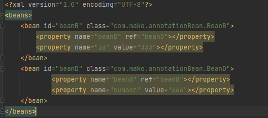
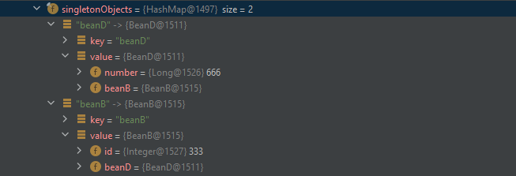
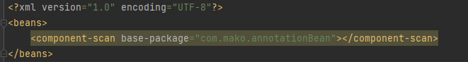
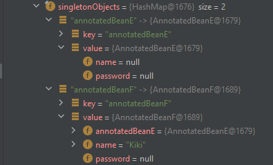

# Results

- 实现基于xml实现的配置文件，支持bean属性配置为bean reference 使用`ref`, 或者配置值用`val`
- 实现基于xml或是annotation配置文件的循环依赖，底层使用2层cache来实现循环依赖的解决
- 实现给予`@Autowire`, `@Service`, `@Value`的bean注解
- 测试代码看`test/java/UnitTestIOC`

### XML 循环依赖

循环依赖xml配置文件

输出结果：

### @Autowire + @Service + @Value

xml配置`component-scan`: 

输出结果：

